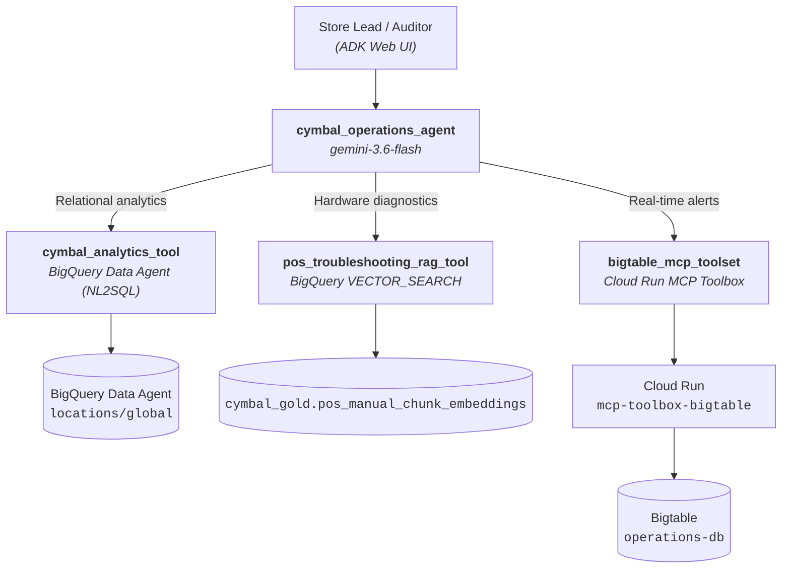

# cymbal-agent

**Cymbal Operations Coordinator Agent** — a multi-tool ADK agent for retail store leads and
auditors. It answers operational questions by routing across three decoupled toolsets:
BigQuery conversational analytics, a POS hardware runbook RAG index, and a real-time
Cloud Bigtable operational store fronted by an MCP microservice.

Built for Module 3 of the Data Analytics Advanced Elevate labs.
Generated with `agents-cli` version `1.5.0`.

## Architecture



| Toolset | Agent-facing tools | Notes |
| :--- | :--- | :--- |
| `cymbal_analytics_tool` | `cymbal_analytics_tool` | Business-glossary terms are forwarded **verbatim** so the Data Agent's semantic layer resolves them. 3× exponential backoff, JSON error contract on persistent failure. |
| `pos_troubleshooting_rag_tool` | `pos_troubleshooting_rag_tool` | Vector search + adjacent chunk stitching (N-1..N+1), `SEARCH()` keyword fallback, GCS→HTTPS citation links, `maximum_bytes_billed` cap. |
| `bigtable_mcp_toolset` | `read_cashier_realtime_alerts`, `read_pos_transactions_enriched` | `McpToolset` is the transport; typed Python wrappers own row-key normalisation and cell decoding. |

### Two design decisions worth knowing

**The Bigtable tools are wrappers, not the raw MCP tools.** The MCP Toolbox returns
Bigtable cells exactly as stored — base64 around raw bytes, where numeric columns are
big-endian IEEE-754 doubles (`"QLStkeuFHrk="` is `5293.57`). A model cannot decode that,
so `BigtableMcpToolset.get_tools()` returns typed wrappers that call through the MCP
session and decode before the payload reaches Gemini. The wrappers also let the model say
"Store 48" instead of hand-building `STORE_048#CASH_1190%`.

**Reported similarity is always true cosine.** An exact error-code match admits a chunk
independently of the `0.70` threshold, but it never inflates the number shown. Ranking uses
a separate internal `rank_score`. This matters because pure cosine ranking puts a different
vendor's manual on top for `ERR-PAY-4001` (HP `0.7028` vs the correct Toshiba `0.6920`),
so the lexical signal is needed for correctness — just not for scoring.

## Project Structure

```
cymbal-agent/
├── app/
│   ├── agent.py               # Coordinator agent + intent routing instructions
│   ├── config.py              # Centralised env/GCP configuration
│   ├── tools/
│   │   ├── analytics_tool.py  # Challenge 2.1 — BigQuery Data Agent (NL2SQL)
│   │   ├── rag_tool.py        # Challenge 2.2 — POS manual vector search
│   │   └── bigtable_tool.py   # Challenge 2.3 — Bigtable via MCP Toolbox
│   └── fast_api_app.py        # FastAPI backend server
├── sql/                       # Challenge 2.2 chunking + embedding pipeline
├── tools.yaml                 # MCP Toolbox config (deployed via Secret Manager)
├── tests/                     # Unit, integration, and eval suites
├── GEMINI.md                  # AI-assisted development guide
└── pyproject.toml             # Project dependencies
```

> 💡 **Tip:** Use [Antigravity CLI](https://antigravity.google/) for AI-assisted development - project context is pre-configured in `GEMINI.md`.

## Setup

```bash
cp .env.example .env      # then fill in your project, Data Agent, and MCP service URL
agents-cli install
```

### Rebuilding the RAG index (Challenge 2.2)

```bash
export PROJECT_ID=<your-project>
for f in sql/0*.sql; do
  sed "s/<PROJECT_ID>/${PROJECT_ID}/g" "$f" | bq query --use_legacy_sql=false --project_id="${PROJECT_ID}"
done
```

`sql/00_baseline_similarity_check.sql` measures the coarse Module 1 embeddings first, so
the improvement from re-chunking is visible rather than assumed.

### Deploying the Bigtable MCP microservice (Challenge 2.3)

```bash
sed "s/<PROJECT_ID>/${PROJECT_ID}/g" tools.yaml > /tmp/tools.yaml
gcloud secrets versions add bigtable-mcp-tools-secret --data-file=/tmp/tools.yaml

gcloud run deploy mcp-toolbox-bigtable \
  --image us-central1-docker.pkg.dev/database-toolbox/toolbox/toolbox:latest \
  --region "${REGION}" --no-allow-unauthenticated \
  --set-secrets=/app/tools.yaml=bigtable-mcp-tools-secret:latest \
  --args=--address=0.0.0.0,--port=8080,--config=/app/tools.yaml
```

The service is private; callers pass an OIDC ID token minted for the service audience.
On Cloudtop, where ADC is a user credential, the agent impersonates the Cloud Run runtime
service account — set `BIGTABLE_MCP_SERVICE_ACCOUNT` to control which one.

## Testing

```bash
uv run pytest tests/unit                     # hermetic, no GCP needed
uv run pytest tests/integration -m "not slow"  # live single-turn checks
uv run pytest tests/integration              # adds parallel/sequential dispatch checks
```

Integration tests assert on the **ADK trace** (which tools were dispatched, and whether
they were grouped into one turn), not just on keywords in the prose.


## Requirements

Before you begin, ensure you have:
- **uv**: Python package manager (used for all dependency management in this project) - [Install](https://docs.astral.sh/uv/getting-started/installation/) ([add packages](https://docs.astral.sh/uv/concepts/dependencies/) with `uv add <package>`)
- **agents-cli**: Agents CLI - Install with `uv tool install google-agents-cli`
- **Google Cloud SDK**: For GCP services - [Install](https://cloud.google.com/sdk/docs/install)


## Quick Start

Install `agents-cli` and its skills if not already installed:

```bash
uvx google-agents-cli setup
```

Install required packages:

```bash
agents-cli install
```

Test the agent with a local web server:

```bash
agents-cli playground
```

You can also use features from the [ADK](https://adk.dev/) CLI with `uv run adk`.

## Commands

| Command              | Description                                                                                 |
| -------------------- | ------------------------------------------------------------------------------------------- |
| `agents-cli install` | Install dependencies using uv                                                         |
| `agents-cli playground` | Launch local development environment                                                  |
| `agents-cli lint`    | Run code quality checks                                                               |
| `agents-cli eval`    | Evaluate agent behavior (generate, grade, analyze, and more — see `agents-cli eval --help`) |
| `uv run pytest tests/unit tests/integration` | Run unit and integration tests                                                        |
| `agents-cli deploy`  | Deploy agent to Agent Runtime                                                                |
| `agents-cli publish gemini-enterprise` | Register deployed agent to Gemini Enterprise                    || [A2A Inspector](https://github.com/a2aproject/a2a-inspector) | Launch A2A Protocol Inspector                                                        |

## 🛠️ Project Management

| Command | What It Does |
|---------|--------------|
| `agents-cli scaffold enhance` | Add CI/CD pipelines and Terraform infrastructure |
| `agents-cli infra cicd` | One-command setup of entire CI/CD pipeline + infrastructure |
| `agents-cli scaffold upgrade` | Auto-upgrade to latest version while preserving customizations |

---

## Development

Edit your agent logic in `app/agent.py` and test with `agents-cli playground` - it auto-reloads on save.

## Deployment

```bash
gcloud config set project <your-project-id>
agents-cli deploy
```

To add CI/CD and Terraform, run `agents-cli scaffold enhance`.
To set up your production infrastructure, run `agents-cli infra cicd`.

## Observability

Built-in telemetry exports to Cloud Trace, BigQuery, and Cloud Logging.

## A2A Inspector

This agent supports the [A2A Protocol](https://a2a-protocol.org/). Use the [A2A Inspector](https://github.com/a2aproject/a2a-inspector) to test interoperability.
See the [A2A Inspector docs](https://github.com/a2aproject/a2a-inspector) for details.
