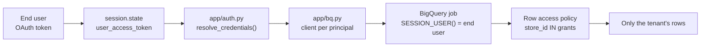

# SQL assets

The BigQuery-side pipeline behind the agent's retrieval and governance features. Every
script uses `<PLACEHOLDER>` tokens; substitute them with `sed` before running.

| Script | Purpose | Idempotent |
| --- | --- | --- |
| `00_baseline_similarity_check.sql` | Diagnostic: raw cosine ranking over the POS manuals, before any lexical boosting. | yes (read-only) |
| `01_chunk_pos_manual.sql` | Sliding-window chunking (500 chars, 100 overlap) of the extracted manual text. | yes (`CREATE OR REPLACE`) |
| `02_generate_embeddings.sql` | Embeds the chunks into `pos_manual_chunk_embeddings`. | yes |
| `03_store_directory_embeddings.sql` | Builds and embeds the store directory for semantic `store_name` → `store_id` resolution. | yes (`CREATE OR REPLACE`) |
| `04_row_level_security.sql` | Multi-tenant row access policies on `pos_transactions_gold`. | yes (`CREATE OR REPLACE POLICY`) |
| `04_row_level_security_teardown.sql` | Removes all row access policies from that table. | yes |

---

## Cost and resource guardrails

Three controls operate at different layers. They are not interchangeable.

### 1. `maximum_bytes_billed` — per query, client side

Set on every job the agent issues, via `app/bq.py`:

```python
bigquery.QueryJobConfig(maximum_bytes_billed=config.MAX_BYTES_BILLED)  # default 1 GB
```

BigQuery rejects an over-budget job **before scanning anything**, so a model-authored
query that accidentally drops its filter fails loudly instead of billing for a full-table
scan. Tune with `MAX_BYTES_BILLED` in `.env`.

### 2. `max_query_result_rows` — per Data Agent call

```python
DataAgentToolConfig(max_query_result_rows=config.DATA_AGENT_MAX_RESULT_ROWS)  # default 50
```

This caps the payload, not the scan. It matters because every returned row re-enters the
model's context on **every subsequent turn** of the conversation — an unbounded result set
is a token-cost leak that compounds, not a one-off charge.

### 3. BigQuery custom quota — per project/user, server side

> [!IMPORTANT]
> `maximum_bytes_billed` **cannot** be applied to the Conversational Data Agent. The Data
> Agent generates and executes its SQL server-side; the client never sees a job config to
> attach a cap to. `max_query_result_rows` is the only client-side lever, and it does not
> limit bytes scanned.

The backstop is a BigQuery custom quota, which is enforced by the service regardless of who
issues the query or how:

```bash
# Cap query bytes scanned per user per day (example: 100 GiB).
gcloud alpha services quota update \
  --service=bigquery.googleapis.com \
  --consumer=projects/$PROJECT_ID \
  --metric=bigquery.googleapis.com/quota/query/usage \
  --unit='1/d/{project}/{user}' \
  --value=107374182400 \
  --force
```

Console equivalent: **IAM & Admin → Quotas → BigQuery API → Query usage per day per user**.

Set this before letting an agent loose on a warehouse. It is the only control that survives
a compromised or misbehaving client.

---

## Multi-tenant isolation (`04_*`)

### Why not do this in the prompt

"Only show this manager their own store" written into a system instruction is a *request*
evaluated by a probabilistic system. Prompt injection, an unusual rephrasing, or a model
upgrade can all route around it. A row access policy is enforced by BigQuery beneath every
tool, so the rows simply are not returned.

This is only meaningful alongside end-user credential delegation (`app/auth.py`). If every
query runs as the agent's own service account, BigQuery sees exactly one principal and
there is nothing to isolate.



### Constraints discovered while applying this

| Constraint | Symptom | Resolution |
| --- | --- | --- |
| Iceberg tables cannot carry row access policies | `BigQuery tables for Apache Iceberg have not been enabled for row-level security` | Policy applied to `pos_transactions_gold` (native storage) instead of the Iceberg-backed `gold_inventory_reconciliation_ledger`. |
| Domain restricted sharing blocks public principals | `One or more users named in the policy do not belong to a permitted customer` | `GRANT TO ('domain:<TENANT_DOMAIN>')` rather than `allAuthenticatedUsers`. |
| First policy locks out everyone unmatched | Agent silently answers "no data" | The operator policy (`FILTER USING (TRUE)`) is created **first** and must cover both the human operator and the agent service account. |
| `INFORMATION_SCHEMA.ROW_ACCESS_POLICIES` not resolvable per dataset | `Table ... was not found in location us-central1` | Inspect with `bq ls --row_access_policies <project>:<dataset>.<table>`. |

> [!WARNING]
> Once **any** row access policy exists on a table, principals matched by **no** policy see
> **zero rows** — not an error. If the agent starts reporting "no data" after applying
> `04_row_level_security.sql`, run the teardown immediately.

### Verifying isolation actually works

Creating the policy proves nothing; only a filtered read does. Temporarily drop the
operator policy, grant yourself a single store, and confirm the row count collapses:

```sql
DROP ROW ACCESS POLICY cymbal_operator_full_access
  ON `<PROJECT_ID>.cymbal_gold.pos_transactions_gold`;

-- Expect 0 rows: you hold no grant.
SELECT COUNT(*) FROM `<PROJECT_ID>.cymbal_gold.pos_transactions_gold`;

INSERT `<PROJECT_ID>.cymbal_governance.store_access_grants`
  (user_email, store_id, granted_by, granted_at)
VALUES (SESSION_USER(), 'STORE_001', 'rls-verification', CURRENT_TIMESTAMP());

-- Expect only STORE_001.
SELECT COUNT(*), STRING_AGG(DISTINCT store_id)
FROM `<PROJECT_ID>.cymbal_gold.pos_transactions_gold`;
```

Measured on this project: **1,233 rows from `STORE_001` alone**, against **65,368 rows
across 50 stores** for the operator. Restore the operator policy afterwards.

---

## Store entity resolution (`03_*`)

`store_directory_embeddings` holds one row per store with a `search_text` surface form
(`"<name> - <city> (<id>)"`) and its 768-dimension embedding.

> [!NOTE]
> Directory vectors are produced with `AI.EMBED(..., endpoint => 'text-embedding-005')` —
> the identical call `app/tools/store_resolution_tool.py` makes on the user's phrase.
> Cosine distance between embeddings from *different* models is meaningless, so these two
> call sites must be changed together or not at all.

The dataset contains a deliberate trap: `STORE_001` and `STORE_013` share the name
*"Cymbal Tokyo Ginza District Flagship"*. Their vectors differ only by the ID inside the
search text, so they score within noise of each other (0.6955 vs 0.6915). The tool detects
this and asks the user to disambiguate rather than silently answering about the wrong store.
